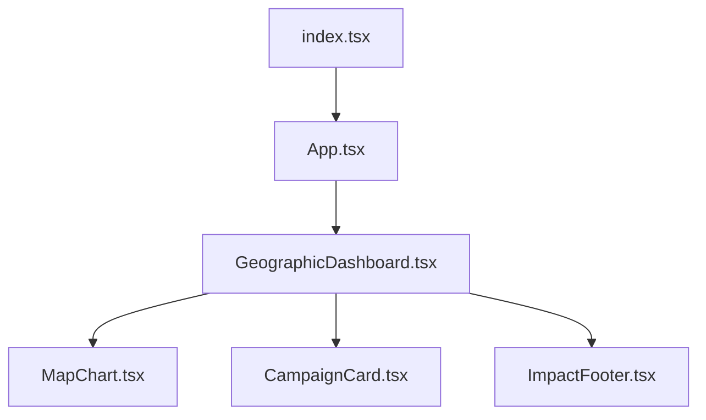
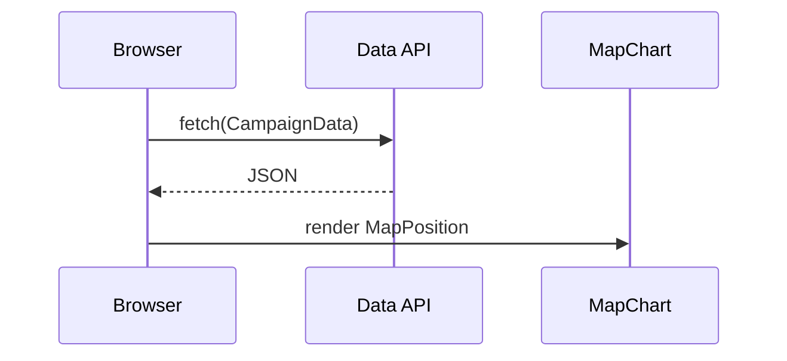

# Architecture

**Status**: Draft  
**Generated**: 2024-10-01  
**Last Updated**: 2024-10-01

## System Architecture Overview

This is a **client-side single-page application (SPA)** built with React and Vite. It forms a **monolithic frontend** focused on visualizing geographic impact data for campaigns in Brazil. The app renders a dashboard with interactive maps, campaign cards, and impact summaries—no backend services or server-side rendering.

**Request Flow**:
1. Browser loads `index.html` and bootstraps `index.tsx`.
2. `index.tsx` mounts `App.tsx` as the root.
3. `App.tsx` orchestrates top-level components like `GeographicDashboard.tsx`.
4. Data (e.g., `CampaignData`) is fetched client-side (likely via API calls in components; implementation details in `constants.ts`).
5. UI renders hierarchically: Dashboard → MapChart + CampaignCard + ImpactFooter.

**Deployment Model**: Static site hosting (e.g., Vercel, Netlify, GitHub Pages). Bundle optimized via Vite for fast loads. No stateful services.

## Architectural Layers

### Presentation Layer (Components)
Reusable React components in `components/` directory. All are functional components with TypeScript interfaces for props.

- **GeographicDashboard** (`components/GeographicDashboard.tsx`): Main container. Props: `DashboardProps`. Renders map, cards, and footer. Imported by 4 files (core orchestrator).
- **MapChart** (`components/MapChart.tsx`): Interactive map view. Props: `MapChartProps`. Handles `MapPosition` state. Imported by 2 files.
- **CampaignCard** (`components/CampaignCard.tsx`): Displays `CampaignData`. Props: `CampaignCardProps`.
- **ImpactFooter** (`components/ImpactFooter.tsx`): Summary footer. Props: `ImpactFooterProps`.

**Conventions**:
- Props interfaces defined locally per component.
- No Redux/Context; props drilling for simplicity (suits small app).
- 4 components total, 0 exported publicly (internal composition).

### Data Layer
- Types: `CampaignData` and `MapPosition` exported from `types.ts` (public API).
- Constants: Hardcoded or config in `constants.ts`.
- Fetching: Assumed via `fetch` or Axios (check `package.json` deps); no ORMs or state managers detected.

### Infrastructure Layer
- Bundler: Vite (`vite.config.ts`).
- Typescript: Strict config (`tsconfig.json`).
- Entry: `index.tsx` → `App.tsx`.

## Detected Design Patterns

- **Component Composition**: `App.tsx` composes dashboard components (Hollywood Principle: "Don't call us, we'll call you").
- **Props-Driven UI**: Stateless components with typed props (React best practice).
- **Type-First Design**: Shared types in `types.ts` enforce contracts.

No advanced patterns like HOCs, Hooks libraries, or CQRS (app scale doesn't require).

## Entry Points

- **`index.tsx`**: Root renderer. Mounts `<App />` to DOM. Single entry for Vite dev/prod.

```
index.tsx → App.tsx → GeographicDashboard.tsx → (MapChart, CampaignCard, ImpactFooter)
```

## Public API

Exported types for extensibility/reuse:

| Symbol | Type | Location | Description |
|--------|------|----------|-------------|
| [`CampaignData`](types.ts#L2) | interface | `types.ts:2` | Core data model for campaigns (e.g., id, name, metrics). |
| [`MapPosition`](types.ts#L15) | interface | `types.ts:15` | Map viewport state (lat, lng, zoom). |

Usage Example:
```tsx
import { CampaignData, MapPosition } from './types';

const data: CampaignData[] = [...];
const position: MapPosition = { lat: -14.235, lng: -51.925, zoom: 4 };
```

## Internal System Boundaries

- **UI Domain**: `components/` owns rendering logic. No cross-domain leaks.
- **Data Boundary**: `types.ts` + `constants.ts` as shared contracts. Components fetch/parse independently.
- **No Persistence**: Client-only; localStorage possible for viewport state.
- Sync: None (stateless app).

## External Service Dependencies

None detected in codebase scan. Assumptions:
- **Map Provider**: Likely Leaflet/OpenLayers or Google Maps (check `MapChart.tsx` imports; add deps to `package.json`).
- **Data API**: Campaign data from external endpoint (e.g., JSONPlaceholder or custom Brazil geo API). Use `fetch` with error boundaries.
  - Auth: None.
  - Rate Limits: Handle with retries.
  - Failures: Offline-first? Add skeleton loaders.

Monitor `package.json` for runtime deps like `react-leaflet`.

## Key Decisions & Trade-offs

| Decision | Rationale | Alternatives | Trade-offs |
|----------|-----------|--------------|------------|
| **Vite + React** | Fast dev server, TS out-of-box, small bundles. | CRA, Next.js | No SSR (SEO ok for dashboard); smaller than Next.js. |
| **No State Mgmt** | Simple props suffice for 4 components. | Zustand/Redux | Avoids boilerplate; refactor if campaigns >50. |
| **Client-Only** | Quick prototype for geo dashboard. | Fullstack (Node/Express) | No server costs; data security via CORS. |
| **TypeScript Types** | Enforces `CampaignData` contracts. | PropTypes | Compile-time safety > runtime checks. |

**ADRs**: None formalized; log in Git issues.

## Diagrams

### Component Hierarchy


### Data Flow


## Risks & Constraints

- **Performance**: Large `CampaignData` arrays → slow maps. Mitigate: Virtualize markers, debounce zooms.
- **Scaling**: >100 campaigns? Paginate or cluster.
- **Browser Compat**: Geo features need modern browsers (polyfill if needed).
- **Data Staleness**: No caching; add SWR/TanStack Query.
- **Assumptions**: Brazil-only bounding box; hardcoded in `constants.ts`.

## Top Directories Snapshot

```
.
├── App.tsx
├── components/ (4 files: GeographicDashboard.tsx, MapChart.tsx, etc.)
├── constants.ts
├── index.tsx
├── types.ts
├── vite.config.ts
├── docs/ (ARCHITECTURE.md, BACKLOG.md, PRD.md)
├── public/
├── package.json
└── ... (18 commands/, metadata, etc.)
```

## Related Resources

- [Product Requirements (PRD.md)](./PRD.md)
- [Backlog (BACKLOG.md)](./BACKLOG.md)
- [Types Reference](./types.ts)
- [Project Details (PROJECT_DETAILS.md)](./PROJECT_DETAILS.md)
- Update on architecture changes: `agents/README.md`
